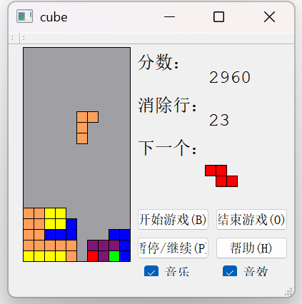

# 俄罗斯方块 - Qt 实现

  


一款基于 **Qt5/Qt6** 开发的经典俄罗斯方块游戏，支持完整的游戏逻辑、音效、帮助提示和游戏结束弹窗。

---

## 🎮 功能特性

- ✅ 经典七种方块（I, O, T, L, J, S, Z）
- ✅ 方块旋转、左右移动、加速下落
- ✅ 消行计分系统（1/2/3/4 行分别得 100/200/400/800 分）
- ✅ 游戏结束检测与得分展示
- ✅ 背景音乐与操作音效（可开关）
- ✅ 内置帮助说明（快捷键与规则）
- ✅ 开始 / 暂停 / 结束 控制

---

## ⌨️ 操作说明

| 按键 | 功能 |
|------|------|
| **方向键 ↑** | 顺时针旋转方块 |
| **方向键 ↓** | 加速下落一格 |
| **方向键 ← / →** | 左右移动方块 |
| **B** | 开始游戏 |
| **P** | 暂停 / 继续 |
| **O** | 结束当前游戏 |
| **H** | 打开帮助窗口 |

> 💡 也可通过界面上的按钮进行操作。

---

## 🛠 编译与运行

### 环境要求
- **Qt 5.9+ 或 Qt 6.x**
- **C++11 支持**
- **qmake**

### 编译步骤
```bash
# 克隆项目
git clone https://github.com/chaojixiaogou/Tetris-based-on-Qt.git

# 使用 qmake 生成 Makefile
qmake erluosifangkuai.pro

# 编译
make  # Linux/macOS
# 或
nmake # Windows (MSVC)
# 或直接在 Qt Creator 中打开 .pro 文件并构建
```

### 运行
```bash
./erluosifangkuai   # Linux/macOS
erluosifangkuai.exe # Windows
```

---

## 📁 项目结构

```
├── erluosifangkuai.pro     # Qt 项目配置文件
├── main.cpp                # 程序入口
├── cube.h / cube.cpp       # 主游戏窗口（核心逻辑）
├── helper.h / helper.cpp   # 帮助对话框
├── gameoverdialog.h / .cpp # 游戏结束弹窗
├── *.ui                    # 界面布局文件（Qt Designer）
├── picture.qrc             # 图片资源（背景、方块等）
└── music.qrc               # 音效与背景音乐资源
```

---

## 📝 注意事项

- 音效文件需包含在 `music.qrc` 中，格式支持 `.wav` / `.mp3`（取决于 Qt 多媒体后端）
- 游戏区域：10 列 × 20 行，每格 15×15 像素
- 得分规则：
  - 每下落一个方块：+10 分
  - 消 1 行：+100 分
  - 消 2 行：+200 分
  - 消 3 行：+400 分
  - 消 4 行：+800 分

---

## 📜 许可证

本项目仅供学习与交流使用。  
如需用于商业用途，请自行替换音效与图片资源。

---


